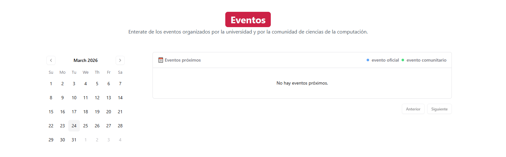
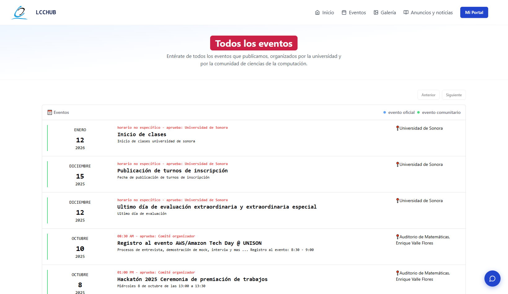
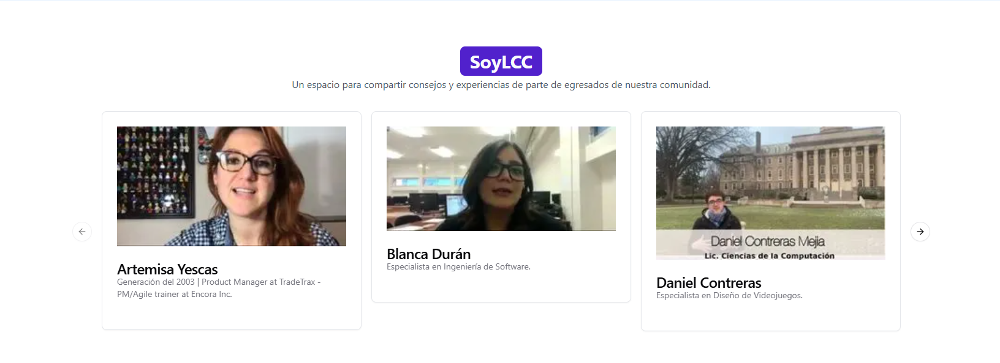
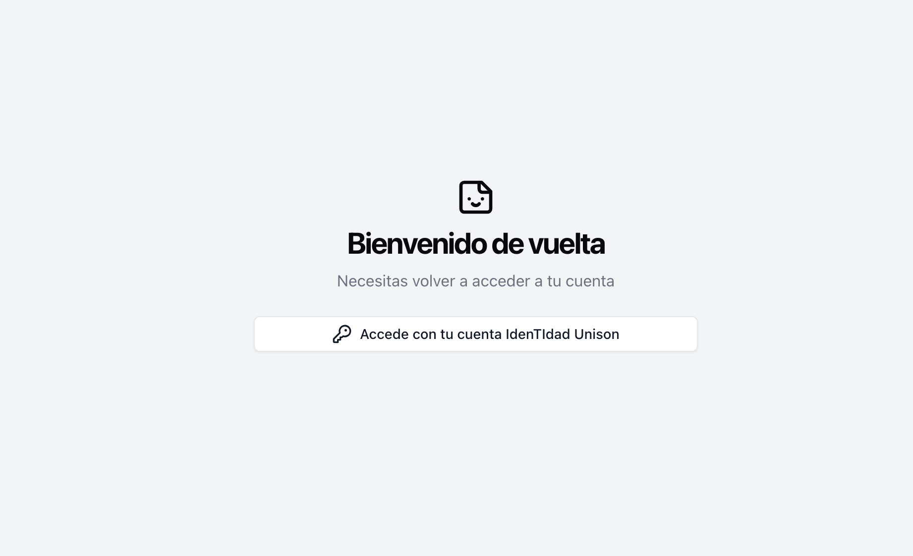
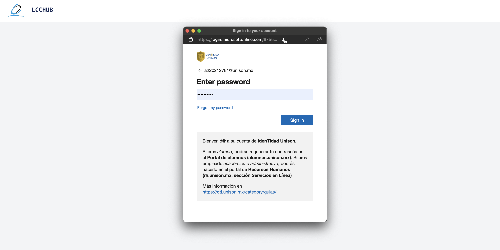
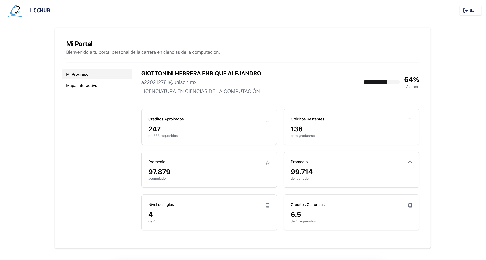
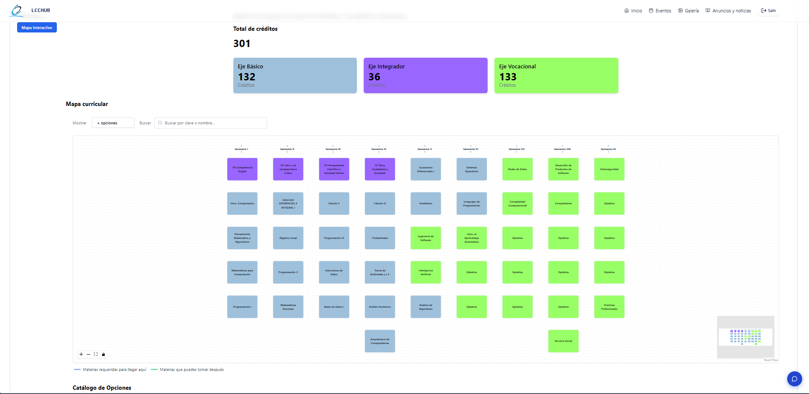
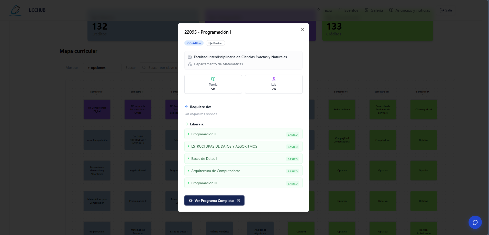
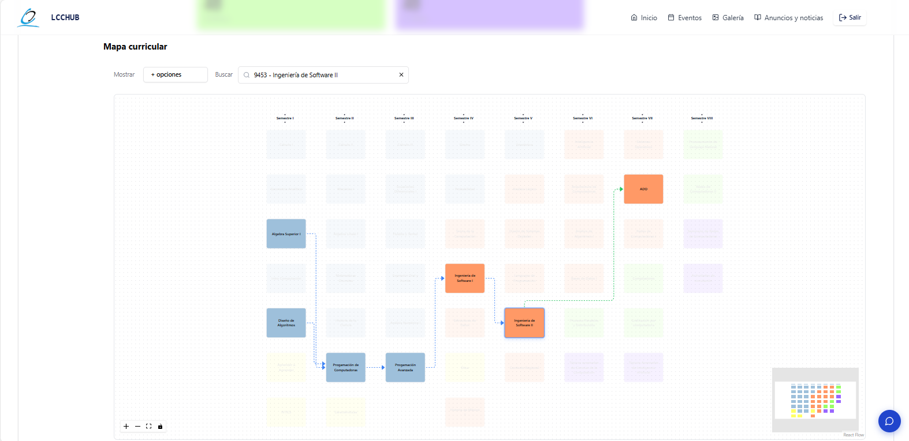
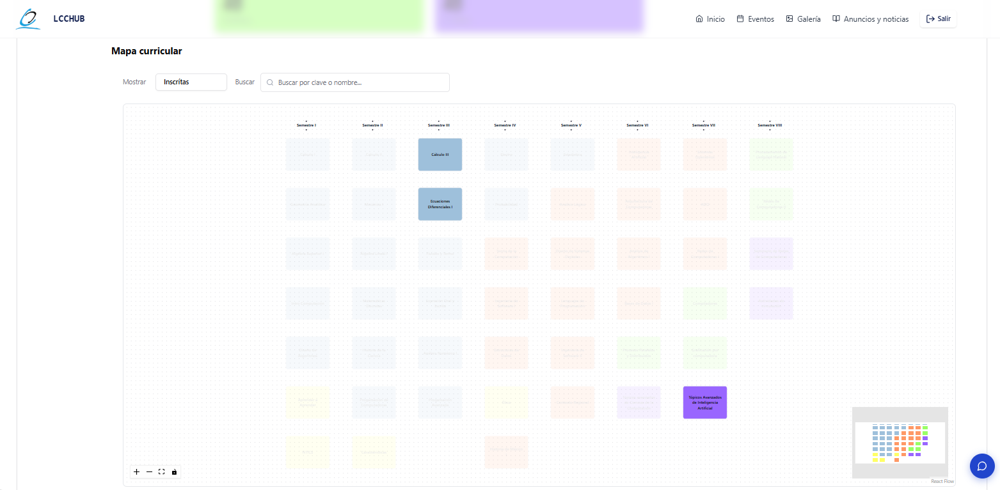

Bienvenido a la guía oficial de LCC Hub. En este documento encontrarás toda la información necesaria sobre cómo navegar por la aplicación y aprovechar al máximo las funcionalidades que ofrece.

## **Sobre la aplicación**

La aplicación LCC Hub es una plataforma web dinámica diseñada para proporcionar información relevante a los estudiantes de la Licenciatura en Ciencias de la Computación (LCC) de la Universidad de Sonora. Impulsada por un Sistema de Gestión de Contenido (CMS), la plataforma funciona como un centro de información en constante actualización, con secciones dedicadas a eventos, testimonios de egresados, oportunidades profesionales y un portal académico exclusivo para alumnos.

## **Página de inicio**

La página principal de LCC Hub es el punto de entrada a la plataforma, desde donde puedes acceder a todas las secciones y funcionalidades. Puedes ingresar directamente a través del siguiente enlace:

> [https://lcc-hub.unison.mx/home](https://lcc-hub.unison.mx/home)

O bien, mediante el menú de navegación del sitio oficial de la carrera:

> [https://cc.unison.mx/](https://cc.unison.mx/)

## **Sección de Eventos**

La sección de eventos ofrece información detallada sobre las actividades (próximas y pasadas) relevantes para la comunidad de LCC. Para facilitar su visualización y fomentar la participación, los eventos se presentan en un formato de calendario y se clasifican en dos tipos:

* **Eventos Oficiales:** Organizados por la Universidad de Sonora o dirigidos formalmente a ella (conferencias, congresos, talleres académicos, etc.).
* **Eventos Comunitarios:** Organizados por y para la comunidad estudiantil (hackatones, torneos de voleibol, eventos rompehielos, etc.).

Puedes consultar el historial de todas las actividades publicadas en la sección [Eventos](https://lcc-hub.unison.mx/home/eventos), accesible desde la barra de navegación superior. Cada tarjeta de evento detalla la fecha, descripción, lugar, el responsable de aprobar la publicación y su categoría (oficial o comunitario).

## **SoyLCC**

"SoyLCC" es una galería de videos donde los egresados de la Licenciatura en Ciencias de la Computación comparten sus experiencias, trayectorias y logros profesionales. Estos testimonios buscan inspirar a los estudiantes actuales y brindarles una perspectiva real sobre las múltiples oportunidades que ofrece la carrera.

Al hacer clic en la fotografía de un egresado, serás redirigido a un video de YouTube con su testimonio. Estos videos son seleccionados cuidadosamente por el equipo de servicio social de LCC Hub y la galería se actualiza constantemente.

## **Portal de Alumnos**

El portal de alumnos, también conocido como "Mi Portal", está integrado con el sistema de identidad de Azure AD para ofrecer un acceso seguro a tu información académica. Aquí podrás consultar tu progreso, materias aprobadas, créditos acumulados y más detalles de tu trayectoria.

Para ingresar, es estrictamente necesario autenticarse utilizando tus credenciales institucionales de la Universidad de Sonora (correo institucional y contraseña).

Si los datos son correctos, accederás inmediatamente a tu perfil personalizado. En caso de ingresar credenciales inválidas, el sistema mostrará un mensaje de error solicitando que lo intentes de nuevo.

## **Mi Portal**

Una vez que hayas iniciado sesión con éxito, accederás a tu panel académico. La página principal de "Mi Portal" se divide en dos grandes herramientas: "Mi Progreso" y el "Mapa Interactivo".

### **Mi Progreso**

Esta sección muestra un resumen cuantitativo de tu trayectoria académica. Incluye indicadores como el número total de materias aprobadas, los créditos que has acumulado hasta el momento y tu promedio general, permitiéndote tener una visión clara de tu avance en la carrera.

### **Mapa Interactivo**

El "Mapa Interactivo" es una representación visual del plan de estudios de la Licenciatura en Ciencias de la Computación.

Al hacer clic sobre el **título** de cualquier materia, se desplegará una ventana con información detallada de la misma: nombre completo, clave, valor en créditos, requisitos para cursarla, entre otros datos.

Si haces clic en la tarjeta de una materia **(fuera del título)**, el mapa resaltará visualmente la seriación, mostrándote exactamente qué materias son prerrequisito de la seleccionada y cuáles materias se desbloquean al aprobarla.

Además, el mapa incluye un menú de filtros en la parte superior que te permite visualizar las materias según su estado actual en tu kardex: aprobadas, dadas de baja, inscritas, reprobadas o en última oportunidad.

---
**Navegación y Cierre de Sesión:**
Puedes regresar a la página principal en cualquier momento haciendo clic en el logo de LCC Hub ubicado en la esquina superior izquierda. Dado que tu sesión se mantiene activa, no necesitarás volver a autenticarte al regresar a "Mi Portal". Para salir de forma segura, haz clic en el botón **Salir** ubicado en la esquina superior derecha de la pantalla.