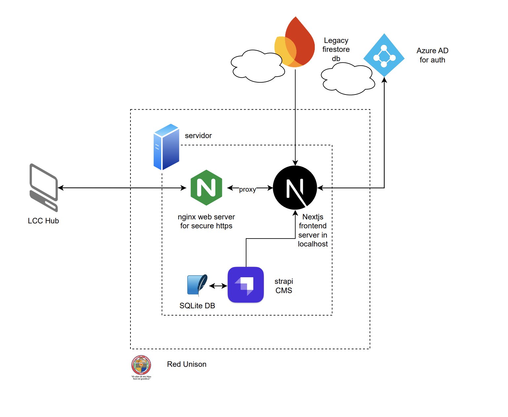

## Diagrama

Cuando un usuario realiza un GET request a la dirección https://lcc-hub.unison.mx, el DNS target gestionado por el área de informática redirige la solicitud a la IP de un servidor dentro de la red Unison.

En dicho servidor, se ejecuta un servidor Nginx, que se encarga de gestionar y dirigir el tráfico hacia la aplicación. Nginx redirige las solicitudes al servidor de Next.js, donde corre el frontend de la aplicación.

El frontend realiza requests hacia un servidor Strapi, que funciona como CMS, expone los endpoints de la API y almacena los datos en una base de datos SQLite.

Adicionalmente, la aplicación realiza requests a un servidor legacy de un proyecto anterior, que contiene datos de alumnos y materias almacenados en Firebase.

Por último, la autenticación de la aplicación se gestiona mediante una SPA de Azure AD, a la cual se accede a través de un token proporcionado por el área de informática.

## Descripción de componentes principales

- **Frontend**: Next.js / React / Tailwind CSS / TypeScript  
- **Backend**: Node.js con Strapi CMS  
- **Autenticación**: Azure Active Directory (AD)  
- **Base de datos**: Firebase y SQLite  
- **Servicios externos**: Azure (autenticación) y Strapi  

---

