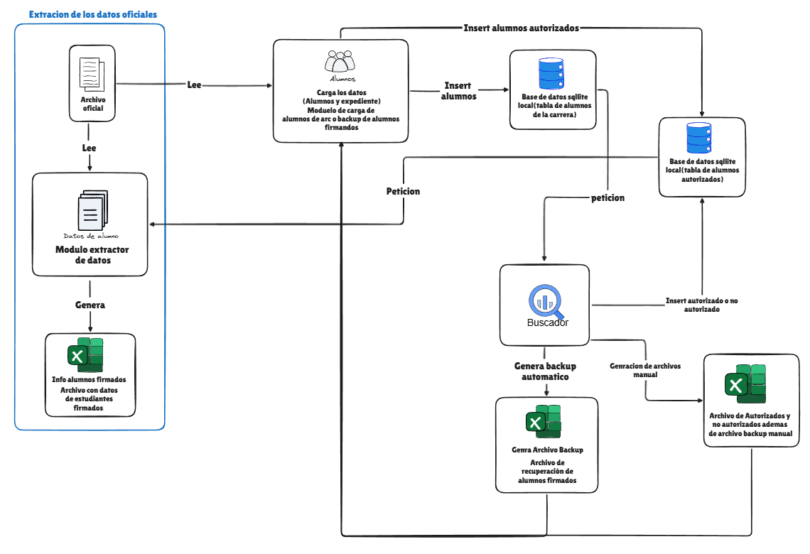

## Diagrama de Flujo de Usuario

El diagrama anterior ilustra el proceso operativo del sistema. El **módulo de extracción** representa el núcleo de la aplicación, diseñado para filtrar grandes volúmenes de datos oficiales. 

Su función principal es realizar una "limpieza inteligente": de un conjunto masivo de registros de la carrera, el sistema identifica y extrae exclusivamente la información de los alumnos que han otorgado su firma y autorización hasta la fecha.

---

## Capacidades del Gestor de Archivos LCCHUB

El **Gestor de Archivos LCCHUB** es una solución integral para el procesamiento y validación de datasets en formatos CSV y Excel. Sus capacidades principales incluyen:

* **Gestión de Autorizaciones:** Búsqueda avanzada de alumnos y control de estados de consentimiento para el uso de datos personales.
* **Ingesta de Datos:** Carga simplificada de archivos maestros con información estudiantil.
* **Procesamiento y Transformación:** Funciones de ordenamiento, limpieza y comparación de registros para garantizar la homogeneidad de la información.
* **Validación Estructural:** Motor de verificación que asegura que los archivos cumplan con el esquema y formato requeridos por el sistema central.